# School Management System Documentation

## Table of Contents
1. [System Overview](#system-overview)
2. [Fee Management System](#fee-management-system)
3. [Profile Management System](#profile-management-system)
4. [Technical Architecture](#technical-architecture)
5. [API Documentation](#api-documentation)
6. [Database Schema](#database-schema)
7. [User Roles & Permissions](#user-roles--permissions)
8. [Security Implementation](#security-implementation)
9. [Deployment Guide](#deployment-guide)
10. [Troubleshooting](#troubleshooting)

---

## System Overview

The School Management System is a comprehensive web application designed to streamline administrative tasks, fee management, and user profile management for educational institutions. The system supports multiple user roles including Administrators, Teachers, Students, and Parents.

### Key Features
- **Multi-role User Management**: Admin, Teacher, Student, Parent
- **Fee Management**: Assignment, tracking, payment processing
- **Profile Management**: User information and password management
- **Attendance Tracking**: Student and teacher attendance
- **Notification System**: Real-time notifications
- **File Upload**: Profile pictures and documents
- **Responsive Design**: Mobile-friendly interface

### Technology Stack
- **Frontend**: React.js, CSS3, HTML5
- **Backend**: Node.js, Express.js
- **Database**: MongoDB
- **Authentication**: JWT (JSON Web Tokens)
- **File Upload**: Multer
- **Validation**: Express-validator

---

## Fee Management System

### Overview
The Fee Management System automates the entire fee lifecycle from assignment to collection and reporting. It provides role-based access for different stakeholders to manage and track fee-related activities.

### Key Features
- ✅ **Fee Assignment**: Assign fees to classes or individual students
- ✅ **Payment Tracking**: Real-time payment status monitoring
- ✅ **Payment History**: Comprehensive transaction records
- ✅ **Receipt Generation**: Automated receipt creation
- ✅ **Notification System**: Payment reminders and confirmations
- ✅ **Analytics Dashboard**: Fee collection reports and insights
- ✅ **Multi-payment Methods**: Support for various payment options

### Detailed Flow Diagram

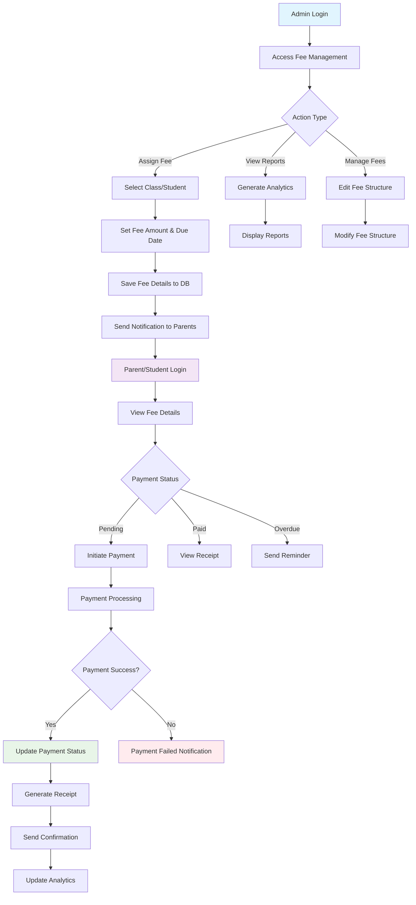

### Fee Management Process Flow

#### 1. Fee Assignment Process
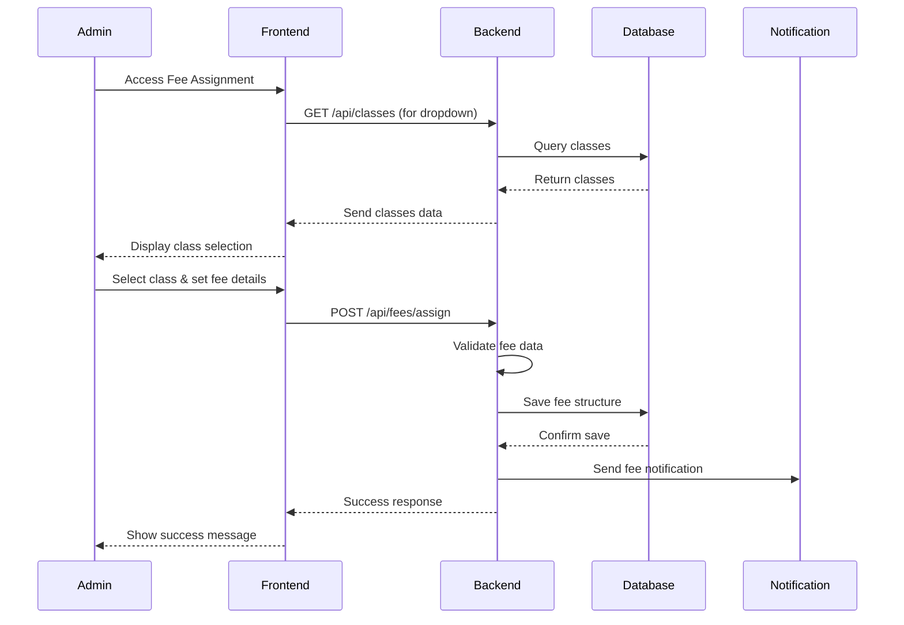

#### 2. Payment Processing Flow
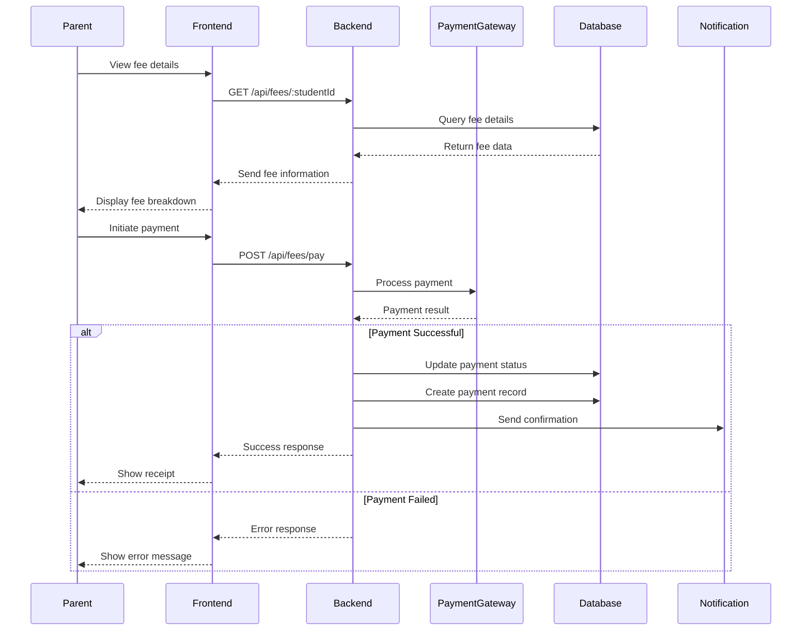

### Fee Management Data Model

```mermaid
erDiagram
    FEE {
        ObjectId _id PK
        String feeType
        Number amount
        Date dueDate
        String description
        ObjectId classId FK
        ObjectId studentId FK
        String status
        Date createdAt
        Date updatedAt
    }
    
    PAYMENT {
        ObjectId _id PK
        ObjectId feeId FK
        ObjectId studentId FK
        Number amount
        String paymentMethod
        String transactionId
        String status
        Date paymentDate
        Date createdAt
    }
    
    STUDENT {
        ObjectId _id PK
        String name
        String rollNumber
        ObjectId classId FK
        ObjectId parentId FK
        String email
        String phone
    }
    
    CLASS {
        ObjectId _id PK
        String className
        String section
        Number academicYear
    }
    
    FEE ||--o{ PAYMENT : "has"
    STUDENT ||--o{ FEE : "assigned"
    STUDENT ||--o{ PAYMENT : "makes"
    CLASS ||--o{ FEE : "has"
```

### Fee Management Examples

#### Example 1: Fee Assignment
```javascript
// Admin assigns fee to Class 10A
const feeAssignment = {
  classId: "507f1f77bcf86cd799439011",
  feeType: "Tuition Fee",
  amount: 5000,
  dueDate: "2024-03-15",
  description: "Monthly tuition fee for March 2024",
  academicYear: 2024
};

// API Response
{
  "success": true,
  "message": "Fee assigned successfully to Class 10A",
  "data": {
    "feeId": "507f1f77bcf86cd799439012",
    "assignedTo": "Class 10A",
    "totalStudents": 35,
    "totalAmount": 175000
  }
}
```

#### Example 2: Payment Processing
```javascript
// Parent makes payment
const paymentData = {
  feeId: "507f1f77bcf86cd799439012",
  studentId: "507f1f77bcf86cd799439013",
  amount: 5000,
  paymentMethod: "Online Banking",
  transactionId: "TXN123456789"
};

// API Response
{
  "success": true,
  "message": "Payment processed successfully",
  "data": {
    "receiptId": "RCP123456789",
    "paymentDate": "2024-03-10T10:30:00Z",
    "status": "Paid",
    "receiptUrl": "/api/receipts/RCP123456789"
  }
}
```

---

## Profile Management System

### Overview
The Profile Management System allows users to view, edit, and manage their personal information, including profile pictures and password changes. The system provides role-specific profile fields and secure password management.

### Key Features
- ✅ **Profile Viewing**: Display user information based on role
- ✅ **Profile Editing**: Update personal information
- ✅ **Password Management**: Secure password change functionality
- ✅ **Profile Picture Upload**: Image upload with validation
- ✅ **Role-based Fields**: Different fields for different user types
- ✅ **Data Validation**: Frontend and backend validation
- ✅ **Security**: Encrypted password storage

### Profile Management Flow Diagram

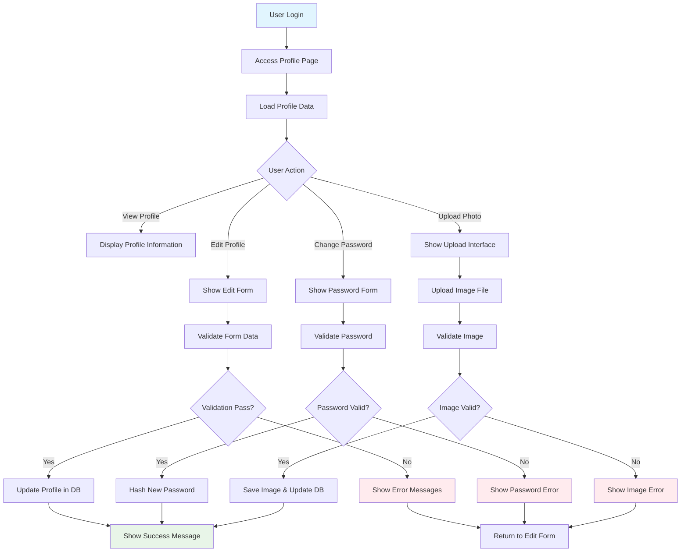

### Profile Management Process Flow

#### 1. Profile Viewing Process
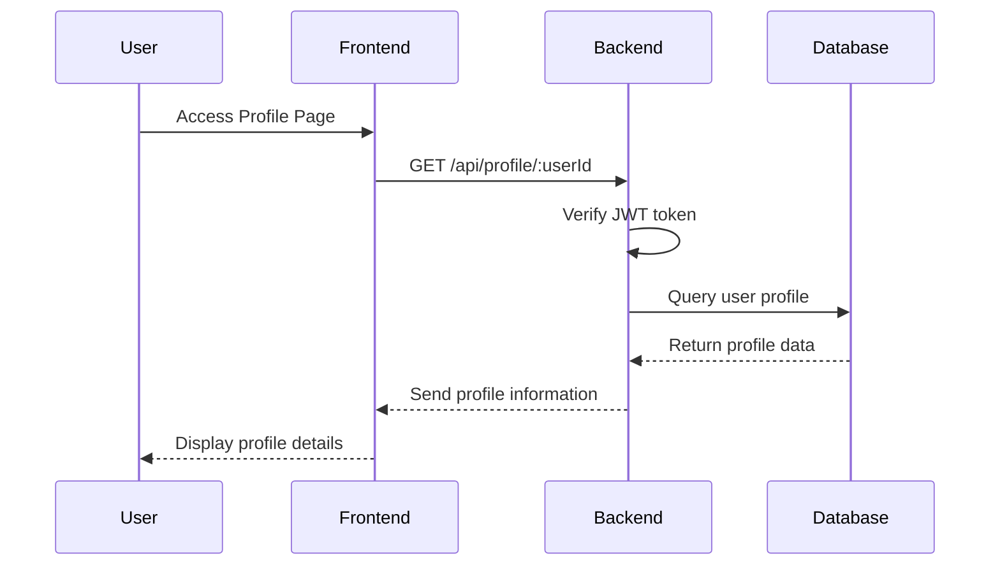

#### 2. Profile Update Process
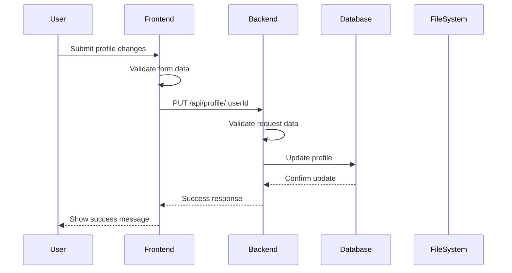

#### 3. Password Change Process
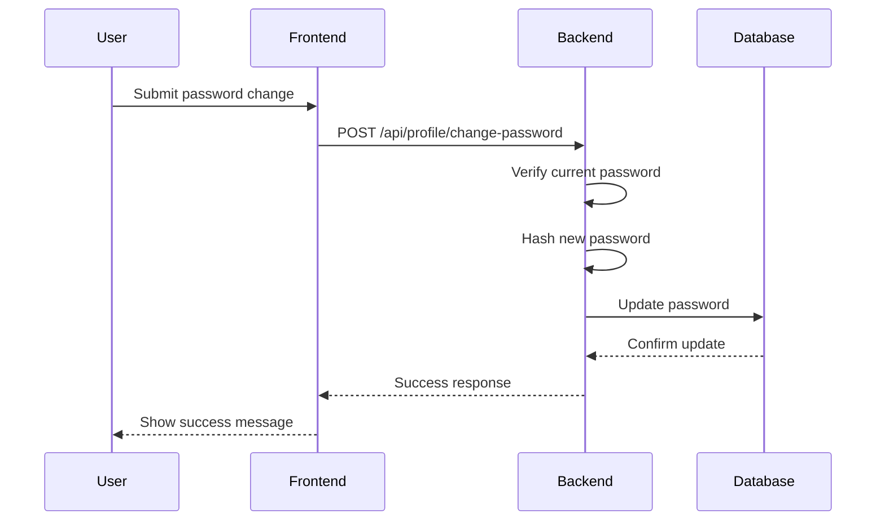

### Profile Management Data Model

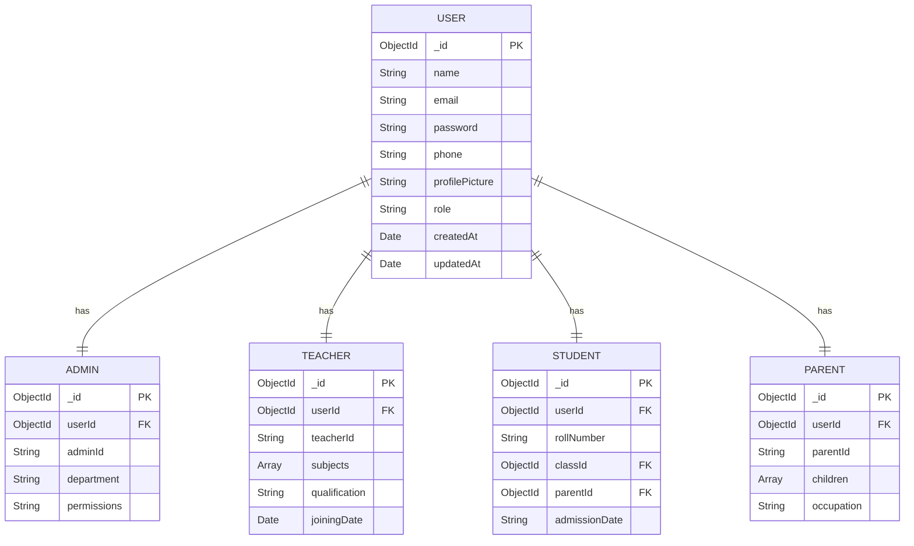

### Role-based Profile Fields

| Field | Admin | Teacher | Student | Parent |
|-------|-------|---------|---------|---------|
| Name | ✅ | ✅ | ✅ | ✅ |
| Email | ✅ | ✅ | ✅ | ✅ |
| Phone | ✅ | ✅ | ✅ | ✅ |
| Profile Picture | ✅ | ✅ | ✅ | ✅ |
| Department | ✅ | ❌ | ❌ | ❌ |
| Subjects | ❌ | ✅ | ❌ | ❌ |
| Roll Number | ❌ | ❌ | ✅ | ❌ |
| Class | ❌ | ❌ | ✅ | ❌ |
| Parent Info | ❌ | ❌ | ✅ | ❌ |
| Children | ❌ | ❌ | ❌ | ✅ |
| Occupation | ❌ | ❌ | ❌ | ✅ |

### Profile Management Examples

#### Example 1: Profile Update
```javascript
// Admin updates profile
const profileUpdate = {
  name: "John Doe",
  email: "john.doe@school.com",
  phone: "+1234567890",
  department: "Administration"
};

// API Response
{
  "success": true,
  "message": "Profile updated successfully",
  "data": {
    "userId": "507f1f77bcf86cd799439014",
    "updatedFields": ["name", "email", "phone", "department"],
    "updatedAt": "2024-03-10T10:30:00Z"
  }
}
```

#### Example 2: Password Change
```javascript
// User changes password
const passwordChange = {
  currentPassword: "oldPassword123",
  newPassword: "newPassword456",
  confirmPassword: "newPassword456"
};

// API Response
{
  "success": true,
  "message": "Password changed successfully",
  "data": {
    "userId": "507f1f77bcf86cd799439014",
    "passwordChangedAt": "2024-03-10T10:30:00Z"
  }
}
```

#### Example 3: Profile Picture Upload
```javascript
// User uploads profile picture
const formData = new FormData();
formData.append('profilePicture', file);

// API Response
{
  "success": true,
  "message": "Profile picture uploaded successfully",
  "data": {
    "imageUrl": "/uploads/Admin/1737034566964.jpeg",
    "fileName": "1737034566964.jpeg",
    "fileSize": "245760"
  }
}
```

---

## Technical Architecture

### System Architecture Diagram

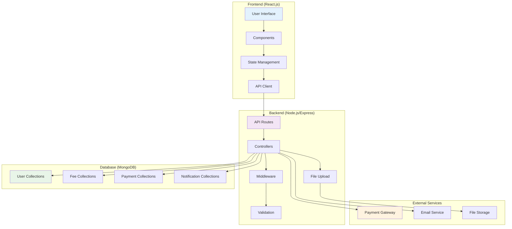

### Data Flow Architecture

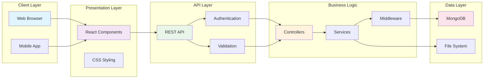

---

## API Documentation

### Fee Management APIs

| Endpoint | Method | Description | Access Level | Request Body | Response |
|----------|--------|-------------|--------------|--------------|----------|
| `/api/fees/assign` | POST | Assign fee to class/student | Admin | `{classId, feeType, amount, dueDate}` | Success/Error |
| `/api/fees/:studentId` | GET | Get fee details for student | Parent/Student | - | Fee details |
| `/api/fees/pay` | POST | Process fee payment | Parent/Student | `{feeId, amount, paymentMethod}` | Payment result |
| `/api/fees/history` | GET | Get payment history | All | - | Payment history |
| `/api/fees/reports` | GET | Generate fee reports | Admin | - | Analytics data |

### Profile Management APIs

| Endpoint | Method | Description | Access Level | Request Body | Response |
|----------|--------|-------------|--------------|--------------|----------|
| `/api/profile/:userId` | GET | Get profile details | All | - | Profile data |
| `/api/profile/:userId` | PUT | Update profile details | All | Profile fields | Success/Error |
| `/api/profile/change-password` | POST | Change password | All | `{currentPassword, newPassword}` | Success/Error |
| `/api/profile/upload-photo` | POST | Upload profile picture | All | FormData | Image URL |

### API Response Examples

#### Success Response
```json
{
  "success": true,
  "message": "Operation completed successfully",
  "data": {
    // Response data
  },
  "timestamp": "2024-03-10T10:30:00Z"
}
```

#### Error Response
```json
{
  "success": false,
  "message": "Error description",
  "error": {
    "code": "VALIDATION_ERROR",
    "details": ["Field validation failed"]
  },
  "timestamp": "2024-03-10T10:30:00Z"
}
```

---

## Database Schema

### Collections Overview

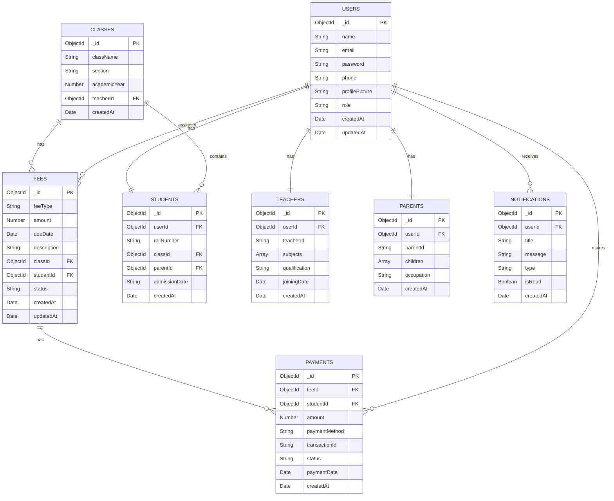

### Indexes for Performance

```javascript
// Fee collection indexes
db.fees.createIndex({ "studentId": 1, "status": 1 })
db.fees.createIndex({ "classId": 1, "dueDate": 1 })
db.fees.createIndex({ "status": 1, "dueDate": 1 })

// Payment collection indexes
db.payments.createIndex({ "studentId": 1, "paymentDate": -1 })
db.payments.createIndex({ "feeId": 1 })
db.payments.createIndex({ "transactionId": 1 }, { unique: true })

// User collection indexes
db.users.createIndex({ "email": 1 }, { unique: true })
db.users.createIndex({ "role": 1 })

// Student collection indexes
db.students.createIndex({ "rollNumber": 1 }, { unique: true })
db.students.createIndex({ "classId": 1 })
db.students.createIndex({ "parentId": 1 })
```

---

## User Roles & Permissions

### Role Hierarchy

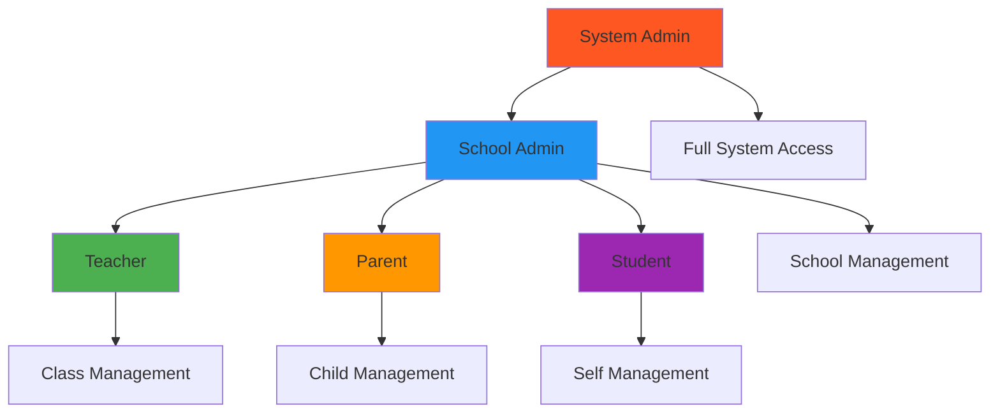

### Permission Matrix

| Feature | Admin | Teacher | Parent | Student |
|---------|-------|---------|---------|---------|
| **Fee Management** |
| Assign Fees | ✅ | ❌ | ❌ | ❌ |
| View All Fees | ✅ | ✅ | ❌ | ❌ |
| View Own Fees | ❌ | ❌ | ✅ | ✅ |
| Make Payments | ❌ | ❌ | ✅ | ✅ |
| Generate Reports | ✅ | ❌ | ❌ | ❌ |
| **Profile Management** |
| View Own Profile | ✅ | ✅ | ✅ | ✅ |
| Edit Own Profile | ✅ | ✅ | ✅ | ✅ |
| Change Password | ✅ | ✅ | ✅ | ✅ |
| Upload Photo | ✅ | ✅ | ✅ | ✅ |
| View Other Profiles | ✅ | ✅ | ❌ | ❌ |
| **User Management** |
| Create Users | ✅ | ❌ | ❌ | ❌ |
| Edit Users | ✅ | ❌ | ❌ | ❌ |
| Delete Users | ✅ | ❌ | ❌ | ❌ |
| **System Access** |
| Dashboard Access | ✅ | ✅ | ✅ | ✅ |
| API Access | ✅ | ✅ | ✅ | ✅ |
| File Upload | ✅ | ✅ | ✅ | ✅ |

### Role-specific Features

#### Admin Features
- Complete fee management control
- User registration and management
- System configuration
- Analytics and reporting
- Class and subject management

#### Teacher Features
- View assigned classes
- Take attendance
- View student profiles
- Manage class fees (view only)
- Update own profile

#### Parent Features
- View children's information
- Pay fees for children
- View payment history
- Receive notifications
- Update own profile

#### Student Features
- View own information
- View assigned fees
- View payment history
- Receive notifications
- Update own profile

---

## Security Implementation

### Authentication Flow

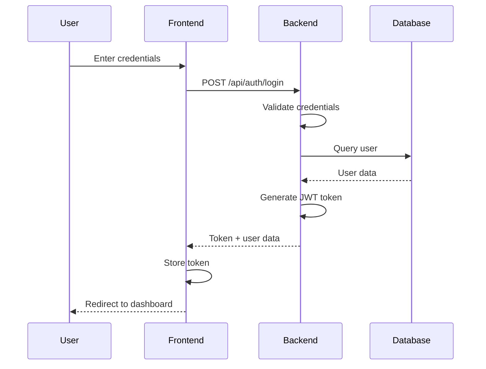

### Security Measures

#### 1. Password Security
```javascript
// Password hashing using bcrypt
const bcrypt = require('bcryptjs');
const saltRounds = 12;

// Hash password
const hashedPassword = await bcrypt.hash(password, saltRounds);

// Verify password
const isValid = await bcrypt.compare(password, hashedPassword);
```

#### 2. JWT Token Management
```javascript
// Token generation
const jwt = require('jsonwebtoken');
const token = jwt.sign(
  { userId: user._id, role: user.role },
  process.env.JWT_SECRET,
  { expiresIn: '24h' }
);

// Token verification middleware
const verifyToken = (req, res, next) => {
  const token = req.headers.authorization?.split(' ')[1];
  if (!token) return res.status(401).json({ message: 'Access denied' });
  
  try {
    const decoded = jwt.verify(token, process.env.JWT_SECRET);
    req.user = decoded;
    next();
  } catch (error) {
    res.status(400).json({ message: 'Invalid token' });
  }
};
```

#### 3. Input Validation
```javascript
// Express-validator implementation
const { body, validationResult } = require('express-validator');

const validateFeeAssignment = [
  body('classId').isMongoId().withMessage('Invalid class ID'),
  body('amount').isNumeric().withMessage('Amount must be numeric'),
  body('dueDate').isISO8601().withMessage('Invalid date format'),
  (req, res, next) => {
    const errors = validationResult(req);
    if (!errors.isEmpty()) {
      return res.status(400).json({ errors: errors.array() });
    }
    next();
  }
];
```

#### 4. File Upload Security
```javascript
// Multer configuration with security
const multer = require('multer');
const path = require('path');

const storage = multer.diskStorage({
  destination: (req, file, cb) => {
    cb(null, 'uploads/');
  },
  filename: (req, file, cb) => {
    const uniqueSuffix = Date.now() + '-' + Math.round(Math.random() * 1E9);
    cb(null, file.fieldname + '-' + uniqueSuffix + path.extname(file.originalname));
  }
});

const fileFilter = (req, file, cb) => {
  const allowedTypes = /jpeg|jpg|png|gif/;
  const extname = allowedTypes.test(path.extname(file.originalname).toLowerCase());
  const mimetype = allowedTypes.test(file.mimetype);
  
  if (mimetype && extname) {
    return cb(null, true);
  } else {
    cb(new Error('Only image files are allowed!'));
  }
};

const upload = multer({
  storage: storage,
  limits: { fileSize: 5 * 1024 * 1024 }, // 5MB limit
  fileFilter: fileFilter
});
```

### Security Best Practices

1. **HTTPS Only**: All communications use HTTPS
2. **CORS Configuration**: Proper CORS setup for API access
3. **Rate Limiting**: API rate limiting to prevent abuse
4. **Input Sanitization**: All inputs are sanitized and validated
5. **SQL Injection Prevention**: Using parameterized queries
6. **XSS Protection**: Content Security Policy headers
7. **CSRF Protection**: CSRF tokens for state-changing operations

---

## Deployment Guide

### Prerequisites
- Node.js (v14 or higher)
- MongoDB (v4.4 or higher)
- npm or yarn package manager

### Environment Setup

#### 1. Backend Environment Variables
```bash
# .env file
NODE_ENV=production
PORT=5000
MONGODB_URI=mongodb://localhost:27017/school_management
JWT_SECRET=your_jwt_secret_key
JWT_EXPIRE=24h
BCRYPT_SALT_ROUNDS=12
UPLOAD_PATH=./uploads
MAX_FILE_SIZE=5242880
```

#### 2. Frontend Environment Variables
```bash
# .env file
REACT_APP_API_URL=http://localhost:5000/api
REACT_APP_UPLOAD_URL=http://localhost:5000/uploads
```

### Installation Steps

#### 1. Backend Setup
```bash
# Navigate to backend directory
cd backend

# Install dependencies
npm install

# Create uploads directory
mkdir uploads
mkdir uploads/Admin
mkdir uploads/Teacher
mkdir uploads/Student
mkdir uploads/Parent

# Start the server
npm start
```

#### 2. Frontend Setup
```bash
# Navigate to frontend directory
cd frontend

# Install dependencies
npm install

# Start the development server
npm start
```

### Production Deployment

#### 1. Backend Deployment (PM2)
```bash
# Install PM2 globally
npm install -g pm2

# Start application with PM2
pm2 start server.js --name "school-management-api"

# Save PM2 configuration
pm2 save

# Setup PM2 to start on system boot
pm2 startup
```

#### 2. Frontend Deployment (Build)
```bash
# Build for production
npm run build

# Serve build files with a static server
npm install -g serve
serve -s build -l 3000
```

### Docker Deployment

#### Dockerfile (Backend)
```dockerfile
FROM node:16-alpine

WORKDIR /app

COPY package*.json ./
RUN npm install --production

COPY . .

EXPOSE 5000

CMD ["npm", "start"]
```

#### Dockerfile (Frontend)
```dockerfile
FROM node:16-alpine as build

WORKDIR /app

COPY package*.json ./
RUN npm install

COPY . .
RUN npm run build

FROM nginx:alpine
COPY --from=build /app/build /usr/share/nginx/html
EXPOSE 80

CMD ["nginx", "-g", "daemon off;"]
```

#### Docker Compose
```yaml
version: '3.8'

services:
  mongodb:
    image: mongo:4.4
    ports:
      - "27017:27017"
    volumes:
      - mongodb_data:/data/db

  backend:
    build: ./backend
    ports:
      - "5000:5000"
    environment:
      - MONGODB_URI=mongodb://mongodb:27017/school_management
    depends_on:
      - mongodb

  frontend:
    build: ./frontend
    ports:
      - "3000:80"
    depends_on:
      - backend

volumes:
  mongodb_data:
```

---

## Troubleshooting

### Common Issues and Solutions

#### 1. Database Connection Issues
```javascript
// Error: MongoDB connection failed
// Solution: Check MongoDB service and connection string
mongoose.connect(process.env.MONGODB_URI, {
  useNewUrlParser: true,
  useUnifiedTopology: true,
  serverSelectionTimeoutMS: 5000,
  socketTimeoutMS: 45000,
});
```

#### 2. File Upload Issues
```javascript
// Error: File upload fails
// Solution: Check directory permissions and file size limits
const upload = multer({
  storage: storage,
  limits: { fileSize: 5 * 1024 * 1024 }, // 5MB
  fileFilter: (req, file, cb) => {
    // Validate file type
    if (file.mimetype.startsWith('image/')) {
      cb(null, true);
    } else {
      cb(new Error('Only images are allowed'));
    }
  }
});
```

#### 3. JWT Token Issues
```javascript
// Error: Token expired or invalid
// Solution: Implement token refresh mechanism
const refreshToken = (req, res) => {
  const { refreshToken } = req.body;
  
  if (!refreshToken) {
    return res.status(401).json({ message: 'Refresh token required' });
  }
  
  try {
    const decoded = jwt.verify(refreshToken, process.env.JWT_REFRESH_SECRET);
    const newToken = jwt.sign(
      { userId: decoded.userId, role: decoded.role },
      process.env.JWT_SECRET,
      { expiresIn: '1h' }
    );
    
    res.json({ token: newToken });
  } catch (error) {
    res.status(401).json({ message: 'Invalid refresh token' });
  }
};
```

#### 4. CORS Issues
```javascript
// Error: CORS policy violation
// Solution: Configure CORS properly
const cors = require('cors');

app.use(cors({
  origin: process.env.FRONTEND_URL || 'http://localhost:3000',
  credentials: true,
  methods: ['GET', 'POST', 'PUT', 'DELETE'],
  allowedHeaders: ['Content-Type', 'Authorization']
}));
```

### Performance Optimization

#### 1. Database Indexing
```javascript
// Create indexes for frequently queried fields
db.fees.createIndex({ "studentId": 1, "status": 1 });
db.payments.createIndex({ "studentId": 1, "paymentDate": -1 });
db.users.createIndex({ "email": 1 }, { unique: true });
```

#### 2. API Response Caching
```javascript
// Implement Redis caching for frequently accessed data
const redis = require('redis');
const client = redis.createClient();

const cacheMiddleware = (duration) => {
  return (req, res, next) => {
    const key = `cache:${req.originalUrl}`;
    
    client.get(key, (err, data) => {
      if (err) return next();
      
      if (data) {
        return res.json(JSON.parse(data));
      }
      
      res.sendResponse = res.json;
      res.json = (body) => {
        client.setex(key, duration, JSON.stringify(body));
        res.sendResponse(body);
      };
      next();
    });
  };
};
```

#### 3. File Upload Optimization
```javascript
// Implement image compression
const sharp = require('sharp');

const compressImage = async (file) => {
  return await sharp(file.buffer)
    .resize(800, 800, { fit: 'inside' })
    .jpeg({ quality: 80 })
    .toBuffer();
};
```

### Monitoring and Logging

#### 1. Application Logging
```javascript
const winston = require('winston');

const logger = winston.createLogger({
  level: 'info',
  format: winston.format.combine(
    winston.format.timestamp(),
    winston.format.json()
  ),
  transports: [
    new winston.transports.File({ filename: 'error.log', level: 'error' }),
    new winston.transports.File({ filename: 'combined.log' })
  ]
});

if (process.env.NODE_ENV !== 'production') {
  logger.add(new winston.transports.Console({
    format: winston.format.simple()
  }));
}
```

#### 2. API Monitoring
```javascript
// Implement API response time monitoring
app.use((req, res, next) => {
  const start = Date.now();
  
  res.on('finish', () => {
    const duration = Date.now() - start;
    logger.info({
      method: req.method,
      url: req.url,
      status: res.statusCode,
      duration: `${duration}ms`
    });
  });
  
  next();
});
```

---

## Conclusion

This documentation provides a comprehensive overview of the School Management System's Fee Management and Profile Management modules. The system is designed with scalability, security, and user experience in mind, supporting multiple user roles with appropriate permissions and features.

### Key Highlights
- **Comprehensive Fee Management**: Complete lifecycle from assignment to payment
- **Role-based Profile Management**: Tailored experience for each user type
- **Secure Implementation**: JWT authentication, password hashing, input validation
- **Scalable Architecture**: Modular design with clear separation of concerns
- **Performance Optimized**: Database indexing, caching, and efficient queries
- **Production Ready**: Docker support, monitoring, and deployment guides

### Future Enhancements
- Real-time notifications using WebSockets
- Advanced analytics and reporting
- Mobile application development
- Integration with external payment gateways
- Multi-language support
- Advanced search and filtering capabilities

For technical support or questions, please refer to the troubleshooting section or contact the development team. 